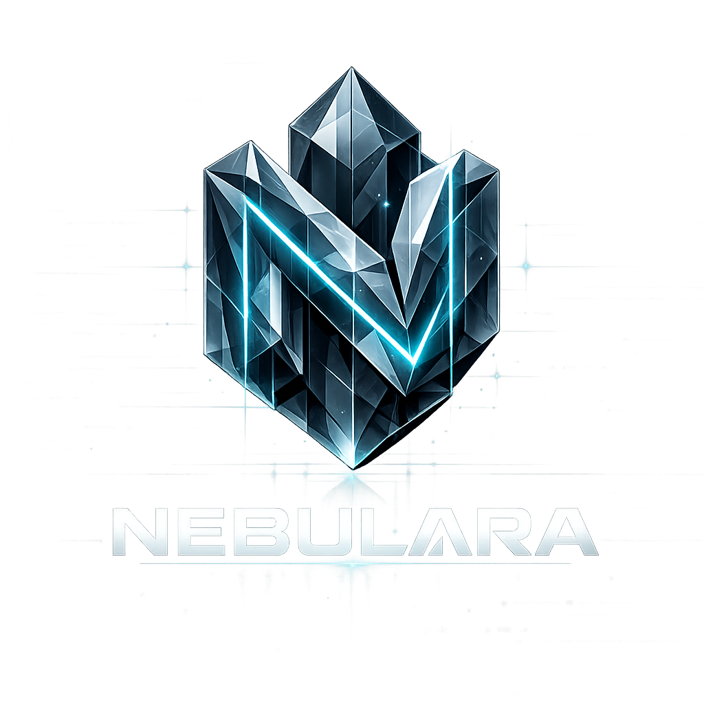

# Nebulara



**Nebulara - Self-hosted native programming language**

A bare-metal compiler that generates x64 PE binaries with zero external dependencies.

[](https://opensource.org/licenses/MIT)
[](https://github.com/CODURRALABS/NEBULARA/releases)
[]()

## Quick Start

```bash
# Build native compiler
gcc Compiler/nbs-bootstrap.c -o nebulara.exe -municode

# Compile .nbs file
nebulara.exe sources/main.nbs -o program.exe

# Run
program.exe
```

## Download v1.0

[**nebulara-v1.0-windows-x64.zip**](v1/nebulara-v1.0-windows-x64.zip)

## Language Features

- **Native compilation** - Direct x64 machine code
- **Self-hosted** - No LLVM, no external toolchain
- **Universal FFI** - Import Node.js, Python, C++, Java, Rust, Go
- **GPU compute** - Native Vulkan support
- **Memory safe** - Bounds checking, garbage collection

## Directory Structure

```
nebulara/
├── Compiler/     # .nbs -> bytecode compiler
├── VM/           # Runtime bytecode interpreter
├── Lib/          # Standard library & FFI
├── Grammar/      # Language grammar
├── Packages/     # Distribution bundles
├── test/         # Test programs
└── assets/       # Logo and resources
```

## Bytecode Opcodes

| Opcode | Description |
|--------|-------------|
| 0x01 | PUSH_INT |
| 0x02 | ADD |
| 0x03 | SUB |
| 0x04 | PRINT |
| 0x05 | CALL |
| 0x06 | RET |
| 0x07 | JUMP |
| 0x08 | JUMP_IF |
| 0x0B | ALLOC |
| 0x0C | SYSCALL |

## Building

```bash
# Native compiler
gcc Compiler/nbs-bootstrap.c -o bin/nebulara.exe -municode -O2

# FFI adapters
gcc Lib/nodejs-adapter.c -o pkg/ffi/nodejs.dll -shared
gcc Lib/python-adapter.c -o pkg/ffi/python.dll -shared
```

## License

MIT - See LICENSE